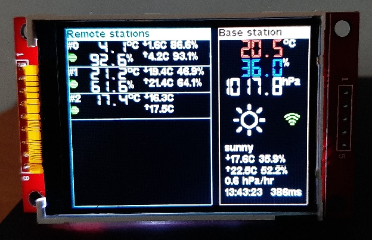
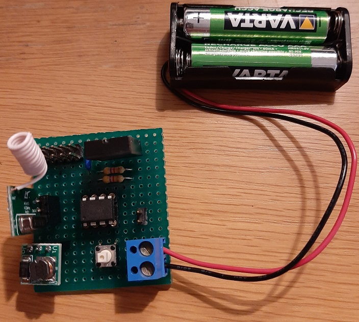
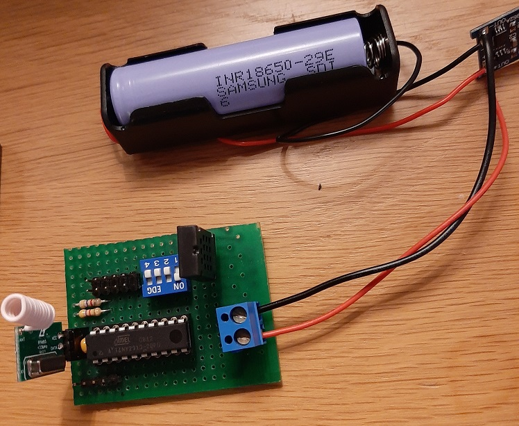

# weather-station

## Base

A barometric sensor is used to implement a simple weather forecasting algorithm by calculating Pa/h. Up to 16 remote AM2320 or DS18B20 sensors can transmit NRZ encoded packets with CRC data using 433MHz ASK/OOK modules connected to the hardware UART at 1200 baud. Minimum and maximum temperatures and humidities are stored over a 24 hour period.

### Hardware

* ATmega328P @ 8 MHz
* RFM210LCF 433MHz ASK/OOK receiver module
* BME280 digital humidity, pressure and temperature sensor
* ILI9341 driver for 240x320 TFT LCD module

### Prototype

## Remote ATtiny25/45/85

Remote temperature sensor module.

### Hardware

* ATtiny25/45/85 @ 1 MHz
* RFM85 433MHz ASK/OOK transmitter module
* AM2320 digital temperature and humidity sensor
* DS18B20 digital temperature sensor
* 1 tactile button

### Prototype

## Remote ATtiny2313/2313A/4313

Remote temperature sensor module.

### Hardware

* ATtiny2313/2313A/4313 @ 1 MHz
* RFM85 433MHz ASK/OOK transmitter module
* AM2320 digital temperature and humidity sensor
* DS18B20 digital temperature sensor
* 4 DIP switches
 
### Prototype

