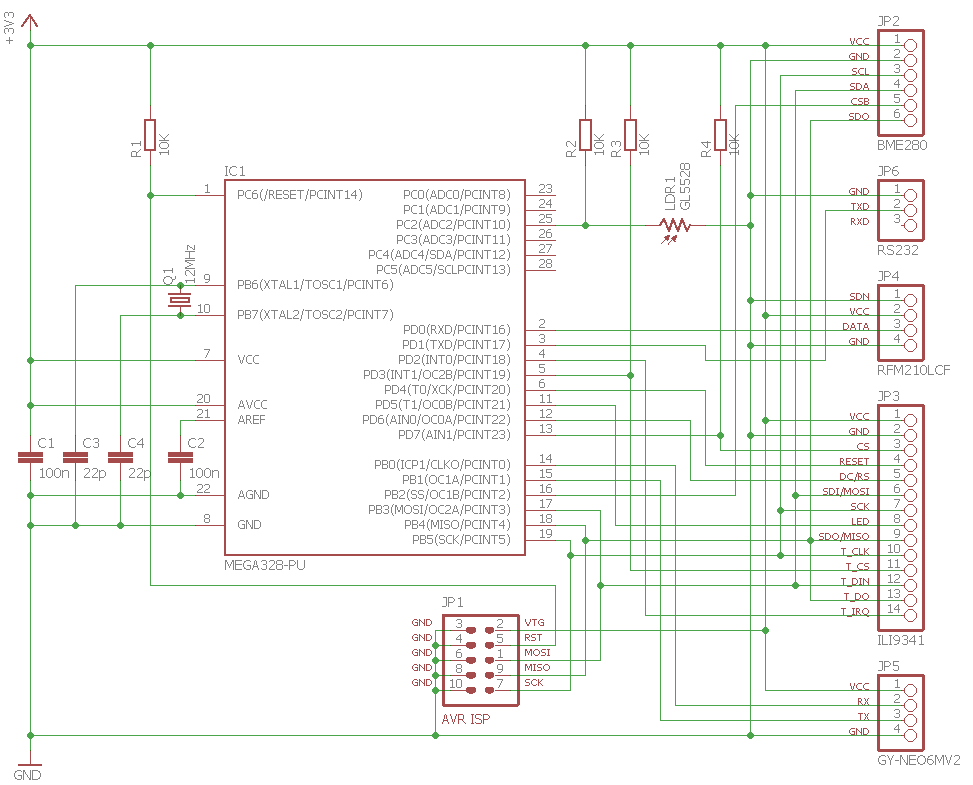
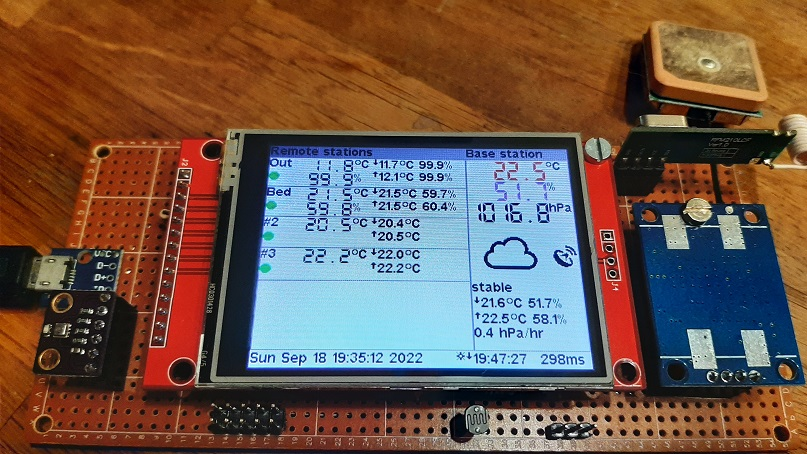
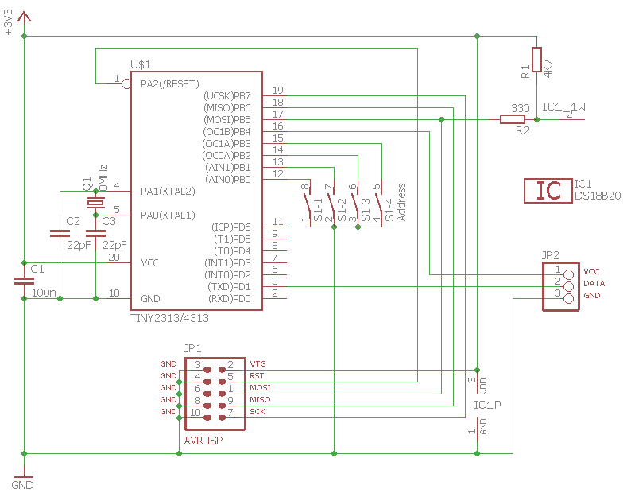

# weather-station

## Base

A BME280 barometric sensor is used to implement a simple weather forecasting algorithm by calculating Pa/h. Up to 16 wireless AHT20, AM2320 or DS18B20 sensors transmit NRZ encoded packets with CRC data using a 433MHz ASK/OOK module connected to the hardware UART at 1200 baud. Up to 6 remote sensors are shown on the LCD. Minimum and maximum temperatures and humidity values are stored in 4 six hour periods. The LCD back light level is auto adjusted using the LDR. A software UART implementation using Timer1 is interfacing with the GPS module at 9600 baud. Libc timekeeping uses the GPS position to determine day and night display mode. Time zone and daylight saving time can be set using the menu which is shown by touching the main screen. The touch screen requires calibration, which is done by touching the screen edges. The remote sensors can be given a 3 character name from the menu.

It uses a speed optimized ILI9341 driver for AVR which implements graphics drawing primitives and uses openGLCD library fonts.

### Hardware

* ATmega328P @ 8 MHz
* RFM210LCF 433MHz ASK/OOK receiver module
* BME280 digital humidity, pressure and temperature sensor
* ILI9341 driver for 240x320 TFT LCD module
* XPT2046 touch screen controller
* NEO-6M GPS module
* GL5528 LDR

### Schematic

### Prototype

Day time display mode:

Night time display mode:

Main menu with touch buttons:

Touch screen keyboard to name remote sensors:

## Remote ATtiny25/45/85

Remote temperature sensor module with drivers for AM2320 and DS18B20 sensor. The tactile button is used to set the unit address. Every 8 seconds a NRZ encoded packet with CRC data is transmitted using a 433MHz ASK/OOK module connected to the USI UART at 1200 baud.

### Hardware

* ATtiny25/45/85 @ 1 MHz
* RFM85 433MHz ASK/OOK transmitter module
* AM2320 digital temperature and humidity sensor
* DS18B20 digital temperature sensor
* 1 tactile button

### Schematic

AM2320 wiring:

DS18B20 wiring:

### Prototype

## Remote ATtiny2313/2313A/4313

Remote temperature sensor module with drivers for AM2320 and DS18B20 sensor. The DIP switches are used to set the unit address. Every 8 seconds a NRZ encoded packet with CRC data is transmitted using a 433MHz ASK/OOK module connected to the hardware USART at 1200 baud.

### Hardware

* ATtiny2313/2313A/4313 @ 1 MHz
* RFM85 433MHz ASK/OOK transmitter module
* AM2320 digital temperature and humidity sensor
* DS18B20 digital temperature sensor
* 4 DIP switches

### Schematic

AM2320 wiring:

DS18B20 wiring:

 
### Prototype

## Firmware
The firmware has been developed in Atmel Studio 7 using GCC C and can be uploaded to the AVR using the ISP connector and an ISP programmer such as [USBasp tool](http://www.fischl.de/usbasp/) using [avrdude](http://www.nongnu.org/avrdude/).

### Base

`avrdude -p m328p -c usbasp -U flash:w:base.hex:i -U lfuse:w:0x62:m -U hfuse:w:0xdf:m`

### Remote ATtiny2313/2313A/4313

`avrdude -p t2313 -c usbasp -U flash:w:remote_2313_4313.hex:i -U lfuse:w:0x7f:m -U hfuse:w:0xdf:m`

### Remote ATtiny25/45/85

`avrdude -p t85 -c usbasp -U flash:w:remote_25_45_85.hex:i -U lfuse:w:0x62:m -U hfuse:w:0xdf:m`
